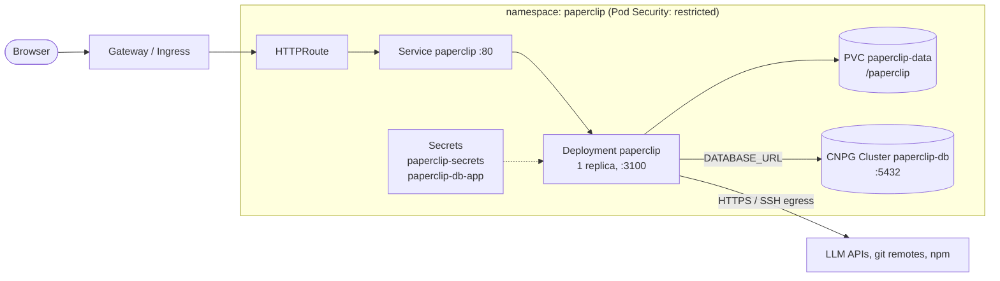
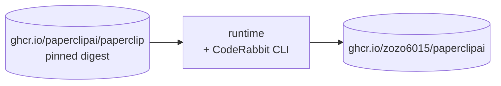

# paperclipai

A hardened container image and Kubernetes deployment for
[Paperclip](https://github.com/paperclipai/paperclip), the open-source app
for managing AI agents for work ([docs](https://docs.paperclip.ing)).

This repository does not fork Paperclip. Its image is the official upstream
image, pinned by digest, plus the [CodeRabbit](https://coderabbit.ai) CLI.
It also provides hardened Kustomize manifests and a Tekton pipeline to build
and publish that image and run it on any Kubernetes cluster.
 
| | |
|---|---|
| Image | `ghcr.io/zozo6015/paperclipai` |
| Base | `ghcr.io/paperclipai/paperclip` (official, multi-arch), pinned in [`docker/Dockerfile`](docker/Dockerfile) |
| Platforms | `linux/amd64`, `linux/arm64` (e.g. Raspberry Pi 4/5 with a 64-bit OS) |
| Added | CodeRabbit CLI (`coderabbit`, `cr`) |
| Runs as | UID/GID 65532, read-only root filesystem |
| Deployment | Kustomize base + components + overlays |
| CI | Tekton (rootless BuildKit, Trivy); no GitHub Actions |

> **Status:** the image built on the official upstream image has not had its
> first Tekton build yet. The Kustomize output is schema-validated.

## Contents

```
docker/Dockerfile                        official image + CodeRabbit CLI
deploy/README.md                         full deployment guide
deploy/kubernetes/base                   cluster-agnostic manifests
deploy/kubernetes/components/
  cloudnativepg                          PostgreSQL via the CloudNativePG operator
  gateway-api                            HTTPRoute on an existing Gateway
  kubernetes-sandbox                     optional RBAC for agent sandbox pods
deploy/kubernetes/overlays/zolab         reference overlay (Cilium, CNPG, iSCSI)
deploy/tekton/base                       build → scan → promote pipeline + GitHub Trigger
deploy/tekton/components/eventlistener   optional dedicated EventListener
deploy/tekton/overlays/zolab             reference overlay (shares an existing EventListener)
```

## Architecture

### Runtime



### CI (Tekton)


- **Server:** one replica using the `Recreate` update strategy. Paperclip runs
  its scheduler in-process and keeps instance data on a ReadWriteOnce volume,
  so two copies must never run at once.
- **Database:** PostgreSQL 5432, from CloudNativePG or any external server. The
  connection string is read from Secret `paperclip-db-app`, key `uri`.
  Migrations are applied automatically on start.
- **UI and API:** served by the same process on port 3100. The health endpoint
  is `/api/health`.

## The image

[`docker/Dockerfile`](docker/Dockerfile) starts from the official
`ghcr.io/paperclipai/paperclip` image, pinned by tag and digest, and adds the
CodeRabbit CLI. Paperclip itself is not rebuilt.



What the upstream image already contains:
- A Debian (trixie) userland with Node 24, `bash`, coreutils, `git`, `gh`,
  `curl`, `wget`, `ripgrep`, `jq`, `python3`, `ssh` and `tini`.
- The agent CLIs for the local adapters: Claude Code, Codex, OpenCode, Gemini
  CLI and Kimi. Upstream installs their newest releases whenever it builds an
  image. They log in from the Paperclip UI and keep their credentials under
  `HOME=/paperclip`, the persistent volume.
- `paperclip-runnerd`, built natively for each platform.

CodeRabbit is installed with its official installer
(`curl -fsSL https://cli.coderabbit.ai/install.sh | sh`) and placed in
`/usr/local/bin` as `coderabbit` and `cr`. The installer always fetches the
current release. The build's layer cache keeps that version until you pass a
new `CODERABBIT_CACHE_EPOCH` build arg. Log in once with
`coderabbit auth login`; the login is stored under `/paperclip` too.

Upstream's entrypoint runs the server directly when the container starts
unprivileged, as it does here (UID 65532 with all capabilities dropped).
`USER_UID`/`USER_GID` in the ConfigMap tell it which user that is.

Build locally (Docker with BuildKit):

```sh
docker buildx build -f docker/Dockerfile -t paperclip:dev .
docker buildx build -f docker/Dockerfile --platform linux/amd64,linux/arm64 \
  -t <registry>/paperclip:dev --push .
```

The build needs network access to ghcr.io and `cli.coderabbit.ai`. The image
is several GB, mostly the agent CLIs.

### Image tags

| Tag | When |
|---|---|
| `sha-<commit>` | every build (commit of *this* repository) |
| `latest` | push to `main`, after the vulnerability scan passes |
| `vX.Y.Z` | push of a `v*` git tag, after the scan passes |
| `<paperclip version>` (e.g. `2026.916.1`) | every clean build: the upstream release the image is based on (`PAPERCLIP_VERSION` in the Dockerfile); moves to the newest build of that release |
| `buildcache` | BuildKit layer cache; not a runnable image |

Deploy by `sha-<commit>` or digest rather than `latest`. Images carry SBOM and
SLSA provenance attestations:

```sh
docker buildx imagetools inspect ghcr.io/zozo6015/paperclipai:<tag> \
  --format '{{ json .SBOM }}'
```

## Quick start

Prerequisites: Kubernetes 1.27+, `kubectl` with Kustomize, a StorageClass
for ReadWriteOnce volumes, and PostgreSQL (the
[CloudNativePG](https://cloudnative-pg.io) operator, or an existing server).

```sh
# 1. Secrets (never commit these)
kubectl create namespace paperclip
kubectl -n paperclip create secret generic paperclip-secrets \
  --from-literal=BETTER_AUTH_SECRET="$(openssl rand -base64 48)" \
  --from-literal=PAPERCLIP_SECRETS_MASTER_KEY="$(openssl rand -base64 32)" \
  --from-literal=PAPERCLIP_AGENT_JWT_SECRET="$(openssl rand -base64 48)"

# 2. An overlay for your cluster (start from overlays/zolab)
cp -r deploy/kubernetes/overlays/zolab deploy/kubernetes/overlays/mycluster
cp deploy/kubernetes/overlays/mycluster/hostnames.env.example \
   deploy/kubernetes/overlays/mycluster/hostnames.env      # set your hostname
#    edit kustomization.yaml: StorageClass, Gateway parentRefs, image tag;
#    drop ciliumnetworkpolicy.yaml if you do not run Cilium

# 3. Deploy
kubectl apply -k deploy/kubernetes/overlays/mycluster
kubectl -n paperclip rollout status deploy/paperclip
```

Then open the URL you set and sign up. Login is always required
(`PAPERCLIP_DEPLOYMENT_MODE=authenticated`).

**Keep a copy of `PAPERCLIP_SECRETS_MASTER_KEY`.** It encrypts the secrets
Paperclip stores in the database, and they cannot be recovered without it.

The full guide, including external databases, the Tekton setup and the
optional agent sandboxes, is in [`deploy/README.md`](deploy/README.md).

## Configuration

Non-secret settings live in the `paperclip-config` ConfigMap
([`base/configmap.yaml`](deploy/kubernetes/base/configmap.yaml)); override
them from an overlay.

| Variable | Default here | Purpose |
|---|---|---|
| `PAPERCLIP_PUBLIC_URL` | set by the overlay | External URL; its hostname is trusted automatically |
| `PAPERCLIP_DEPLOYMENT_MODE` | `authenticated` | Always require login |
| `PAPERCLIP_DEPLOYMENT_EXPOSURE` | `private` | `private` for LAN/VPN-only instances, `public` for internet-facing ones |
| `PAPERCLIP_ALLOWED_HOSTNAMES` | unset | Extra comma-separated hostnames to trust |
| `PAPERCLIP_MIGRATION_AUTO_APPLY` | `true` | Apply database migrations on start |
| `DATABASE_URL` | Secret `paperclip-db-app` / `uri` | PostgreSQL connection string |
| `BETTER_AUTH_SECRET` | Secret `paperclip-secrets` | Session/auth signing secret |
| `PAPERCLIP_SECRETS_MASTER_KEY` | Secret `paperclip-secrets` | Encryption key for stored secrets |
| `ANTHROPIC_API_KEY` / `CLAUDE_CODE_OAUTH_TOKEN` | Secret `paperclip-secrets` (optional) | Claude Code credentials, instead of logging in from the UI |
| `USER_UID` / `USER_GID` | `65532` | The pod's user, for the upstream entrypoint |

See upstream
[`docs/deploy/environment-variables.md`](https://github.com/paperclipai/paperclip/blob/master/docs/deploy/environment-variables.md)
for the full list.

### Site-specific values stay out of git

Hostnames and similar environment details belong in a git-ignored
`hostnames.env` next to each overlay (see `hostnames.env.example`). Kustomize
injects them at build time and refuses to build without the file. Secrets are
always created with `kubectl` (or your secret manager), never committed.

## Security

| Area | Setting |
|---|---|
| Pod Security | namespace enforces `restricted` |
| User | UID/GID 65532, `runAsNonRoot` |
| Filesystem | read-only root; writable only `/paperclip` (PVC) and `/tmp` (emptyDir, 2 GiB) |
| Privileges | all capabilities dropped, no privilege escalation, `RuntimeDefault` seccomp |
| API access | no service-account token mounted (unless the sandbox component is enabled) |
| Network | namespace default-deny; server egress limited to DNS, 5432, 443, 80, 22 |
| Supply chain | upstream image pinned by digest, SBOM + provenance attestations, Trivy gate before release tags |
| PID 1 | `tini`, which reaps orphaned agent child processes |

The Tekton build namespace (`paperclip-ci`) is the one exception to
`restricted`: rootless BuildKit needs `Unconfined` seccomp/AppArmor to create
user namespaces. It still runs as UID 1000 with no added capabilities, so keep
that namespace for builds only.

## Upgrading Paperclip

1. Pick a release from the
   [upstream packages](https://github.com/paperclipai/paperclip/pkgs/container/paperclip).
2. In [`docker/Dockerfile`](docker/Dockerfile), set `PAPERCLIP_IMAGE` to its
   tag and index digest, and `PAPERCLIP_VERSION` to the release. Get the
   digest with:

   ```sh
   docker buildx imagetools inspect ghcr.io/paperclipai/paperclip:<version> \
     --format '{{ .Manifest.Digest }}'
   ```
3. Push to `main`. Tekton builds, scans and tags the new image.
4. Set `newTag: sha-<commit>` in your overlay and `kubectl apply -k …`.
   Migrations run automatically on start. Back up the database first.

## Operations

```sh
kubectl -n paperclip logs deploy/paperclip -f          # server logs
kubectl -n paperclip get cluster paperclip-db          # CNPG status
kubectl -n paperclip port-forward svc/paperclip 3100:80   # bypass the Gateway
kubectl -n paperclip-ci get pipelineruns               # CI history
```

- **Backups:** not configured here. Set up
  [CNPG backups](https://cloudnative-pg.io/documentation/current/backup/) for
  the database and snapshot the `paperclip-data` volume. The master key must be
  backed up separately.
- **Pod stuck `Pending`:** check that the PVC is bound (StorageClass) and that
  the `paperclip-secrets` and `paperclip-db-app` Secrets exist.
- **Readiness failing on first start:** migrations can take a while. The
  startup probe allows up to 10 minutes.
- **502 or 404 from the Gateway:** check that the Gateway listener's
  `allowedRoutes` admits the `paperclip` namespace and that the HTTPRoute is
  `Accepted` (`kubectl -n paperclip describe httproute paperclip`).

## License

This repository is licensed under the Apache License 2.0 (see
[LICENSE](LICENSE)). Paperclip itself is MIT-licensed by Paperclip AI.
