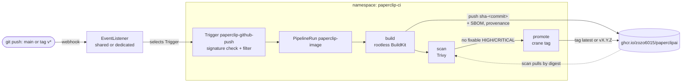
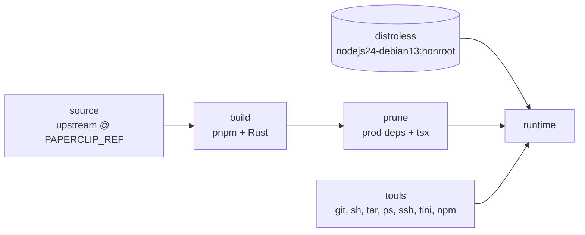

# paperclipai

A hardened container image and Kubernetes deployment for
[Paperclip](https://github.com/paperclipai/paperclip), the open-source app
for managing AI agents for work ([docs](https://docs.paperclip.ing)).

This repository does not fork Paperclip. It builds upstream Paperclip at a
pinned commit into a small, non-root, distroless image, and provides
Kustomize manifests and a Tekton pipeline to run and publish it on any
Kubernetes cluster.

| | |
|---|---|
| Image | `ghcr.io/zozo6015/paperclipai` |
| Runtime base | `gcr.io/distroless/nodejs24-debian13:nonroot` (UID 65532) |
| Upstream version | commit pinned in `ARG PAPERCLIP_REF` in [`docker/Dockerfile`](docker/Dockerfile) |
| Deployment | Kustomize base + components + overlays |
| CI | Tekton (rootless BuildKit, Trivy); no GitHub Actions |

> **Status:** the image has not yet completed an end-to-end build; the first
> Tekton run is its first full build. The Kustomize output is schema-validated.

## Contents

```
docker/Dockerfile                        multi-stage image build
deploy/README.md                         full deployment guide
deploy/kubernetes/base                   cluster-agnostic manifests
deploy/kubernetes/components/
  cloudnativepg                          PostgreSQL via the CloudNativePG operator
  gateway-api                            HTTPRoute on an existing Gateway
  kubernetes-sandbox                     optional RBAC for agent sandbox pods
deploy/kubernetes/overlays/zolab         reference overlay (Cilium, CNPG, iSCSI)
deploy/tekton/base                       build → scan → promote pipeline + GitHub Trigger
deploy/tekton/components/eventlistener   optional dedicated EventListener
deploy/tekton/overlays/zolab             reference overlay (shares an existing EventListener)
```

## Architecture

### Runtime


### CI (Tekton)



- **Server:** one replica using the `Recreate` update strategy. Paperclip runs
  its scheduler in-process and keeps instance data on a ReadWriteOnce volume,
  so two copies must never run at once.
- **Database:** PostgreSQL 5432, from CloudNativePG or any external server. The
  connection string is read from Secret `paperclip-db-app`, key `uri`.
  Migrations are applied automatically on start.
- **UI and API:** served by the same process on port 3100. The health endpoint
  is `/api/health`.

## The image

Built in stages:



1. **source**: upstream Paperclip fetched at `PAPERCLIP_REF` (no `.git`).
2. **build**: pnpm install, then UI, plugin SDK and server builds, plus the
   Rust `paperclip-runnerd` binary the server vendors. It also prebuilds the
   Kubernetes sandbox-provider plugin.
3. **prune**: devDependencies removed; `tsx` (the runtime loader) installed in
   isolation.
4. **tools**: `git`, `sh` (dash), `tar`, `ps`, `ssh`, `tini` and `npm`, with
   only the shared libraries the distroless base lacks, and a chroot smoke test.
5. **runtime**: the distroless base, plus the tools, plus the app.

Why it is not *pure* distroless: the Paperclip server itself runs `git`,
`tar` and `sh` (workspace clones, sandbox payloads) and `npm` (plugin
installs). Everything else a normal Debian image has is absent: there is no
package manager, no compilers and no coding-agent CLIs. Package metadata for
the copied tools is kept, so image scanners still report their CVEs.

**Limitation:** because no agent CLIs (Claude Code, Codex, Gemini, …) are
included, adapters that run a CLI *inside the Paperclip container* do not work.
Run agents in sandbox pods (see
[`kubernetes-sandbox`](deploy/kubernetes/components/kubernetes-sandbox)) or
through remote/gateway adapters.

Build locally (Docker with BuildKit):

```sh
docker buildx build -f docker/Dockerfile -t paperclip:dev .

# a different upstream commit
docker buildx build -f docker/Dockerfile \
  --build-arg PAPERCLIP_REF=<upstream commit sha> -t paperclip:dev .
```

The build needs network access to GitHub, the npm registry, crates.io,
static.rust-lang.org and the Debian mirrors. It is memory-hungry (UI + Rust
build); the Tekton build step requests 6 GiB and is capped at 12 GiB.

### Image tags

| Tag | When |
|---|---|
| `sha-<commit>` | every build (commit of *this* repository) |
| `latest` | push to `main`, after the vulnerability scan passes |
| `vX.Y.Z` | push of a `v*` git tag, after the scan passes |
| `buildcache` | BuildKit layer cache; not a runnable image |

Deploy by `sha-<commit>` or digest rather than `latest`. Images carry SBOM and
SLSA provenance attestations:

```sh
docker buildx imagetools inspect ghcr.io/zozo6015/paperclipai:<tag> \
  --format '{{ json .SBOM }}'
```

## Quick start

Prerequisites: Kubernetes 1.27+, `kubectl` with Kustomize, a StorageClass
for ReadWriteOnce volumes, and PostgreSQL (the
[CloudNativePG](https://cloudnative-pg.io) operator, or an existing server).

```sh
# 1. Secrets (never commit these)
kubectl create namespace paperclip
kubectl -n paperclip create secret generic paperclip-secrets \
  --from-literal=BETTER_AUTH_SECRET="$(openssl rand -base64 48)" \
  --from-literal=PAPERCLIP_SECRETS_MASTER_KEY="$(openssl rand -base64 32)"

# 2. An overlay for your cluster (start from overlays/zolab)
cp -r deploy/kubernetes/overlays/zolab deploy/kubernetes/overlays/mycluster
cp deploy/kubernetes/overlays/mycluster/hostnames.env.example \
   deploy/kubernetes/overlays/mycluster/hostnames.env      # set your hostname
#    edit kustomization.yaml: StorageClass, Gateway parentRefs, image tag;
#    drop ciliumnetworkpolicy.yaml if you do not run Cilium

# 3. Deploy
kubectl apply -k deploy/kubernetes/overlays/mycluster
kubectl -n paperclip rollout status deploy/paperclip
```

Then open the URL you set and sign up. Login is always required
(`PAPERCLIP_DEPLOYMENT_MODE=authenticated`).

**Keep a copy of `PAPERCLIP_SECRETS_MASTER_KEY`.** It encrypts the secrets
Paperclip stores in the database, and they cannot be recovered without it.

The full guide, including external databases, the Tekton setup and the
optional agent sandboxes, is in [`deploy/README.md`](deploy/README.md).

## Configuration

Non-secret settings live in the `paperclip-config` ConfigMap
([`base/configmap.yaml`](deploy/kubernetes/base/configmap.yaml)); override
them from an overlay.

| Variable | Default here | Purpose |
|---|---|---|
| `PAPERCLIP_PUBLIC_URL` | set by the overlay | External URL; its hostname is trusted automatically |
| `PAPERCLIP_DEPLOYMENT_MODE` | `authenticated` | Always require login |
| `PAPERCLIP_DEPLOYMENT_EXPOSURE` | `private` | `private` for LAN/VPN-only instances, `public` for internet-facing ones |
| `PAPERCLIP_ALLOWED_HOSTNAMES` | unset | Extra comma-separated hostnames to trust |
| `PAPERCLIP_MIGRATION_AUTO_APPLY` | `true` | Apply database migrations on start |
| `DATABASE_URL` | Secret `paperclip-db-app` / `uri` | PostgreSQL connection string |
| `BETTER_AUTH_SECRET` | Secret `paperclip-secrets` | Session/auth signing secret |
| `PAPERCLIP_SECRETS_MASTER_KEY` | Secret `paperclip-secrets` | Encryption key for stored secrets |

See upstream
[`docs/deploy/environment-variables.md`](https://github.com/paperclipai/paperclip/blob/master/docs/deploy/environment-variables.md)
for the full list.

### Site-specific values stay out of git

Hostnames and similar environment details belong in a git-ignored
`hostnames.env` next to each overlay (see `hostnames.env.example`). Kustomize
injects them at build time and refuses to build without the file. Secrets are
always created with `kubectl` (or your secret manager), never committed.

## Security

| Area | Setting |
|---|---|
| Pod Security | namespace enforces `restricted` |
| User | UID/GID 65532, `runAsNonRoot` |
| Filesystem | read-only root; writable only `/paperclip` (PVC) and `/tmp` (emptyDir, 2 GiB) |
| Privileges | all capabilities dropped, no privilege escalation, `RuntimeDefault` seccomp |
| API access | no service-account token mounted (unless the sandbox component is enabled) |
| Network | namespace default-deny; server egress limited to DNS, 5432, 443, 80, 22 |
| Supply chain | base images pinned by digest, SBOM + provenance attestations, Trivy gate before release tags |
| PID 1 | `tini`, which reaps orphaned `git`/`ssh` child processes |

The Tekton build namespace (`paperclip-ci`) is the one exception to
`restricted`: rootless BuildKit needs `Unconfined` seccomp/AppArmor to create
user namespaces. It still runs as UID 1000 with no added capabilities, so keep
that namespace for builds only.

## Upgrading Paperclip

1. Pick an upstream commit from
   [paperclipai/paperclip](https://github.com/paperclipai/paperclip/commits).
2. Update `ARG PAPERCLIP_REF` in `docker/Dockerfile` and push to `main`. Tekton
   builds, scans and tags the new image.
3. Set `newTag: sha-<commit>` in your overlay and `kubectl apply -k …`.
   Migrations run automatically on start. Back up the database first.

## Operations

```sh
kubectl -n paperclip logs deploy/paperclip -f          # server logs
kubectl -n paperclip get cluster paperclip-db          # CNPG status
kubectl -n paperclip port-forward svc/paperclip 3100:80   # bypass the Gateway
kubectl -n paperclip-ci get pipelineruns               # CI history
```

- **Backups:** not configured here. Set up
  [CNPG backups](https://cloudnative-pg.io/documentation/current/backup/) for
  the database and snapshot the `paperclip-data` volume. The master key must be
  backed up separately.
- **Pod stuck `Pending`:** check that the PVC is bound (StorageClass) and that
  the `paperclip-secrets` and `paperclip-db-app` Secrets exist.
- **Readiness failing on first start:** migrations can take a while. The
  startup probe allows up to 10 minutes.
- **502 or 404 from the Gateway:** check that the Gateway listener's
  `allowedRoutes` admits the `paperclip` namespace and that the HTTPRoute is
  `Accepted` (`kubectl -n paperclip describe httproute paperclip`).

## License

This repository is licensed under the Apache License 2.0 (see
[LICENSE](LICENSE)). Paperclip itself is MIT-licensed by Paperclip AI.
